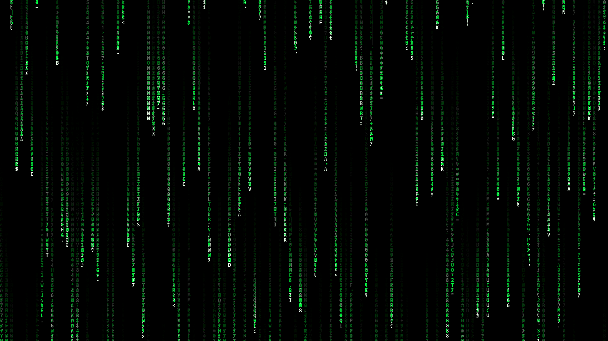
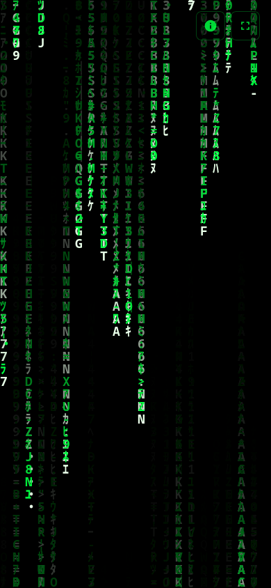

# Matrix Digital Rain 🟢

[](https://opensource.org/licenses/MIT)
[](https://github.com/barizshah/matrix-digital-rain/releases/tag/v2.0.0)
[](https://developer.mozilla.org/en-US/docs/Web/API/Canvas_API)
[](https://developer.mozilla.org/en-US/docs/Web/JavaScript)
[](https://barizshah.github.io/matrix-digital-rain/)

A lightweight, pure, zero-dependency HTML5 Canvas and vanilla JavaScript implementation of the iconic **Matrix Digital Rain** (falling code) visual effect. Clean, distraction-free, and meticulously optimized for both mobile and desktop screens.

[🌐 **View Live Demo**](https://barizshah.github.io/matrix-digital-rain/)

---

## 🖥️ Desktop Preview



---

## 📱 Mobile Preview

<p align="center">
  
</p>

---

## ✨ Features in v2.0.0

- 🟢 **Pure & Distraction-Free**: Clean, authentic Matrix visual effect with no bloated menus, complex UI, or unnecessary dependencies.
- ⚡ **Zero Dependencies**: Pure HTML5 Canvas and vanilla JavaScript (`0` libraries, `0` external assets).
- 💚 **Authentic Movie Visuals**: Glowing bright white-hot lead glyphs cascading into phosphor neon-green fading trails (`#00FF41`).
- ⛶ **Auto-Hiding Fullscreen**: Unobtrusive fullscreen button that smoothly fades out after 3 seconds of inactivity, plus double-tap/double-click and <kbd>F</kbd> shortcut support.
- 📱 **Mobile & Desktop Optimized**:
  - Automatically adapts font size and column density for desktop (`16px`) and mobile (`18px`).
  - Device Pixel Ratio (DPR) capped at 2 to ensure razor-sharp text on Retina/OLED displays while preserving GPU fill-rate and battery life.
  - Safe-area insets support (`viewport-fit=cover`, `env(safe-area-inset-*)`) for notched phone displays.
- 💤 **Screensaver Mode (Screen Wake Lock)**: Keeps the screen awake like an authentic screensaver while active, automatically releasing the wake lock when paused or minimized to preserve battery.
- 🔣 **Rich Character Stream**: Authentic half-width Japanese Katakana (`ﾊﾐﾋｰｳｼﾅﾓﾆ...`), Latin letters, numbers, and matrix symbols.
- 👆 **Interactive Touch & Ripple**: Tap, click, or drag anywhere across the screen to scatter falling code streams.

---

## ⌨️ Controls & Gestures

| Control / Gesture | Action |
| :--- | :--- |
| **Tap / Click** | Trigger digital rain ripple at pointer location |
| **Move Mouse / Touch** | Reveal fullscreen control |
| **Double Tap / Double Click** | Toggle Fullscreen mode |
| <kbd>F</kbd> | Toggle Fullscreen |
| <kbd>Space</kbd> | Pause / Resume animation |

---

## 🚀 Quick Start

### 1. Run Directly in Browser
Clone the repository and open `index.html`:

```bash
git clone https://github.com/barizshah/matrix-digital-rain.git
cd matrix-digital-rain

# Open on Linux
xdg-open index.html

# OR open on macOS
open index.html
```

### 2. Run with a Local Web Server
You can also use Python's built-in HTTP server:

```bash
python3 -m http.server 8000
```
Then open your browser to [http://localhost:8000](http://localhost:8000).

---

## 🛠️ Customization

Animation parameters can be tweaked directly inside `index.html`:

```javascript
// Authentic Katakana, Latin symbols, and numbers
const chars = 'ﾊﾐﾋｰｳｼﾅﾓﾆｻﾜﾂｵﾘｱﾎﾃｹﾒｴｶｷﾑﾕﾗｾﾈｽﾀﾇﾍ0123456789ABCDEFGHIJKLMNOPQRSTUVWXYZ:・."=*+-<>¦｜';

// Target 30 FPS for iconic film cadence + thermal/battery efficiency
const TARGET_FPS = 30;

// Trail fade rate (lower alpha = longer trails)
ctx.fillStyle = 'rgba(0, 0, 0, 0.08)';
```

---

## 🤝 Contributing

Contributions, bug reports, and feature suggestions are welcome!
Feel free to open an [issue](https://github.com/barizshah/matrix-digital-rain/issues) or submit a pull request.

If you like this project, consider giving it a ⭐ on GitHub!

---

## 📄 License

Distributed under the MIT License. See [LICENSE](LICENSE) for details.
