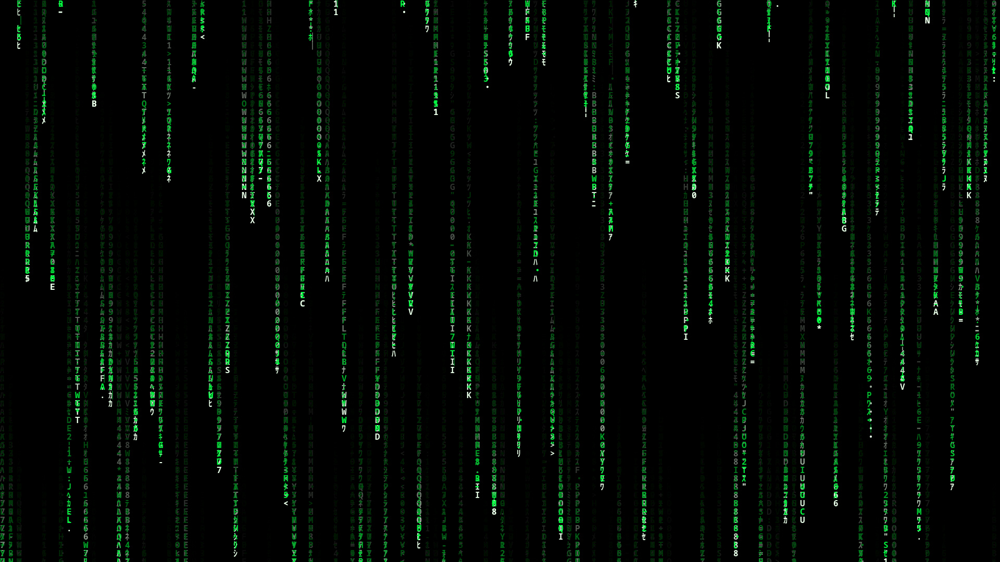

# Matrix Digital Rain 🟢

A lightweight, zero-dependency HTML5 Canvas implementation of the iconic **Matrix Digital Rain** visual effect. Featuring cascading Japanese Katakana & alphanumeric characters, glowing lead glyphs, dynamic resizing, and realistic speed/fade physics.



---

## ✨ Features

- ⚡ **Zero Dependencies**: Pure HTML5 Canvas & vanilla JavaScript (`0` external libraries).
- 💚 **Authentic Visuals**: Bright white glowing lead characters with neon green trailing streams.
- 📐 **Fully Responsive**: Dynamically adjusts to window resizing without distortion.
- 🚀 **High Performance**: Optimized 30 FPS rendering loop with lightweight DOM footprint.
- 🔣 **Rich Character Set**: Includes classic Japanese Katakana (`ﾊﾐﾋｰｳｼﾅﾓﾆ...`) and alphanumeric characters.

---

## 🚀 Quick Start

### Option 1: Open Directly in Browser
Simply clone the repository and double-click `index.html` (or `matrix.html`):

```bash
git clone https://github.com/barizssh/matrix-digital-rain.git
cd matrix-digital-rain
open index.html # On macOS
# OR
xdg-open index.html # On Linux
```

### Option 2: Run Local Web Server
Using Python's built-in HTTP server:

```bash
python3 -m http.server 8000
```
Then visit `http://localhost:8000` in your web browser.

---

## 🛠️ Customization

You can easily tweak animation parameters directly inside `index.html`:

```javascript
// Change character set
const chars = 'ﾊﾐﾋｰｳｼﾅﾓﾆｻﾜﾂｵﾘｱﾎﾃｹﾒｴｶｷﾑﾕﾗｾﾈｽﾀﾇﾍ0123456789ABCDEFGHIJKLMNOPQRSTUVWXYZ';

// Adjust font size and column density
const fontSize = 16; 

// Lead character glow color
ctx.shadowColor = '#00FF41'; 
ctx.shadowBlur = 8;

// Trail fade rate (lower opacity = longer trail)
ctx.fillStyle = 'rgba(0, 0, 0, 0.05)';
```

---

## 📋 Release Notes

### Version 1.0.0 (v1.0.0)
- Initial official release of Matrix Digital Rain visualizer.
- Responsive canvas renderer with smooth fade effect.
- Canvas glowing shadow effects on lead characters.

---

## 📄 License

Distributed under the MIT License. See [`LICENSE`](LICENSE) for more details.
